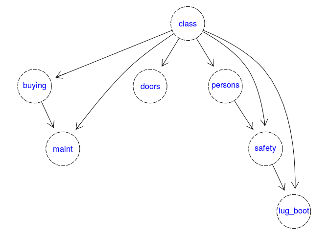

bnclassify
==========

[](https://travis-ci.org/bmihaljevic/bnclassify) [](https://codecov.io/github/bmihaljevic/bnclassify?branch=master) [](http://www.gnu.org/licenses/gpl-2.0.html) [](http://cran.r-project.org/package=bnclassify)  

Implements algorithms for learning discrete Bayesian network classifiers from data, as well as functions for using these classifiers for prediction, assessing their predictive performance, and inspecting and analyzing their properties.

Example
=======

Load a data set and learn a one-dependence estimator by maximizing the Bayesian information criterion (BIC) score.

``` r
library(bnclassify)
data(car)
tn <- tan_cl('class', car, score = 'bic')
tn
#> 
#>   Bayesian network classifier (only structure, no parameters)
#> 
#>   class variable:        class 
#>   num. features:   6 
#>   num. arcs:   6 
#>   learning algorithm:    tan_cl
plot(tn)
```



After learning the network's parameters, you can use it to classify data.

``` r
tn <- lp(tn, car, smooth = 0.01)
p <- predict(tn, car, prob = TRUE)
head(p)
#>          unacc          acc         good        vgood
#> [1,] 1.0000000 2.171346e-10 8.267214e-16 3.536615e-19
#> [2,] 0.9999937 6.306269e-06 5.203338e-12 5.706038e-19
#> [3,] 0.9999908 9.211090e-06 5.158884e-12 4.780777e-15
#> [4,] 1.0000000 3.204714e-10 1.084552e-15 1.015375e-15
#> [5,] 0.9999907 9.307467e-06 6.826088e-12 1.638219e-15
#> [6,] 0.9999864 1.359469e-05 6.767760e-12 1.372573e-11
p <- predict(tn, car, prob = FALSE)
head(p)
#> [1] unacc unacc unacc unacc unacc unacc
#> Levels: unacc acc good vgood
```

Estimate predictive accuracy with cross validation.

``` r
cv(tn, car, k = 10)
#> [1] 0.8599223
```

Or compute the log-likelihood

``` r
logLik(tn, car)
#> 'log Lik.' -13503.84 (df=63)
```

Install
=======

Make sure you have at least version 3.2.0 of R. You will need to install packages from Bioconductor.

``` r
source("http://bioconductor.org/biocLite.R")
biocLite(c("graph", "RBGL", "Rgraphviz"))
```

You can install `bnclassify` from CRAN:

``` r
install.packages('bnclassify')
```

Or get the current development version from Github:

``` r
# install.packages('devtools')
devtools::install_github('bmihaljevic/bnclassify', build_vignettes = TRUE)
```

Overview
========

See the list of implemented functionalities.

``` r
?bnclassify
```

Use the introduction vignette to get started.

``` r
vignette('introduction', package = 'bnclassify')
```

Then have a look at the remaining vignettes.

``` r
browseVignettes("bnclassify")
```
